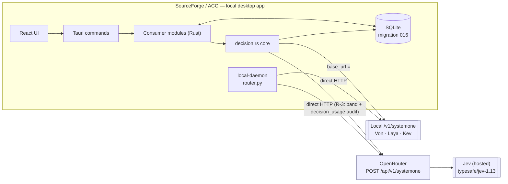
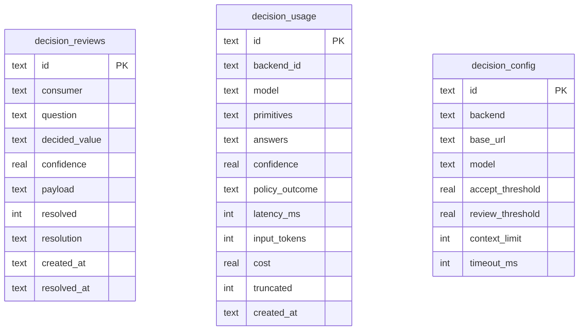

# Architecture — Jev integration into SourceForge/ACC

**Spec:** 001-decision-layer · **Status:** v3 (rounds 1–4 applied · reviewer verdict: clear-with-open-risks) · **Date:** 2026-09-26
**Companions:** `spec.md`, `plan.md`, `implementation-details/*`, `docs/adr/0001`, `docs/adr/0002`
**Reviews:** `review-round1.md`, `review-round2.md`, `review-round3.md`, `review-round4.md`, `review-round5.md`, `review-round6.md`, `review-round7.md`

---

## 1. Purpose & scope
Record exactly **how Jev (hosted decision model) is integrated**, the **value each point adds**,
and the **reachability + risks** — truthfully. Jev is used only for judgement calls
(`choice`/`score`/`noul`); it never writes prose or code. One `/v1/systemone` contract serves
hosted Jev and a local open-weight backend.

> **Status discipline:** a decision call is only "wired" if it is **reachable at runtime** from a
> registered command or the daemon. Several functions are implemented and unit-tested but sit
> inside a caller that is itself unreachable (a pre-existing orphaning, not a decision-layer
> regression). Those are marked **Unreachable** and tracked as follow-ups in §8.

## 2. Context



## 3. Component & reachability view

Solid = reachable from a registered command/daemon · dashed = implemented but **not reachable**.

```mermaid
flowchart TB
  subgraph FE["Frontend (React)"]
    SP["Settings → DecisionPanel\n(backend, model, health, review queue)"]
  end

  subgraph CMD["Tauri command layer (commands.rs, all registered in lib.rs)"]
    C1["route_task_cmd ✅"]
    C2["create_budget_cmd ✅"]
    C3["compound_knowledge_cmd ✅\n(run_compounder_cmd ✗ does not exist)"]
    C4["verify_project_cmd ✅"]
    C5["get/set_decision_config_cmd ✅"]
    C6["decision_health_cmd ✅"]
    C7["list/resolve_decision_review_cmd ✅"]
    C10["infer_outcome_cmd ✅ (new)"]
    C11["diagnose_failure_cmd ✅ (new)"]
    C12["parse_handoff_file_cmd ✅ (now State-aware)"]
    C13["run_compounder_cmd ✅ (new)"]
    C14["run_kg_extraction_cmd ✅ (new)"]
  end

  subgraph CONS["Decision consumers"]
    R1["routing.rs::route_task ✅ reachable"]
    R5["budget.rs::create_budget ✅ reachable"]
    R9["knowledge.rs::compound_knowledge ✅ reachable\n(merge confidence)"]
    R8["verification.rs::semantic_checks ◐ partial\n(README noul runs; secrets noul inert)"]
    R2["knowledge.rs::run_compounder ✅ reachable"]
    R3["kg_extraction.rs::persist_extraction ✅ reachable"]
    R4["intelligence.rs::suggest_outcome_decision ✅ reachable"]
    R6["intelligence.rs::failure_confidence_decision ✅ reachable"]
    R7["handoff_parser.rs::semantic_handoff_confidence ✅ reachable"]
    R10["knowledge.rs::detect_and_record_contradictions ✅ reachable\n(via run_compounder)"]
  end

  subgraph CORE["decision.rs"]
    CFG["DecisionConfig (get/set)"]
    REQ["decision_request + bounded retry"]
    NORM["normalize_response + validation"]
    TR["UreqTransport (timeout)"]
    POL["classify_confidence"]
    RV["enqueue_review ✅ (via routing band)"]
    HP["health_probe"]
    DSP["dispatch_mode ⚠ no production caller"]
  end

  subgraph STORE["SQLite (016)"]
    U[("decision_usage")]
    V[("decision_reviews")]
    W[("decision_config")]
  end

  JEV[["Jev /v1/systemone"]]
  LCL[["Local /v1/systemone"]]

  SP --> C5 & C6 & C7
  C5 --> CFG
  C6 --> HP --> REQ
  C7 --> V

  C1 --> R1 --> REQ
  C2 --> R5 --> REQ
  C3 --> R9 --> REQ
  C4 --> R8 --> REQ
  C10 --> R4 --> REQ
  C11 --> R6 --> REQ
  C12 --> R7 --> REQ
  C13["run_compounder_cmd ✅ (new)"] --> R2
  C13 --> R10
  C14["run_kg_extraction_cmd ✅ (new)"] --> R3
  R2 --> REQ
  R3 --> REQ
  R10 --> REQ

  REQ --> NORM
  REQ --> TR --> JEV
  TR --> LCL
  REQ --> POL
  REQ --> U
  W -.-> CFG
  CFG -.-> REQ
  RV --> V
```



## 4. A single decision call

```mermaid
sequenceDiagram
  autonumber
  participant UI as UI / Tauri command
  participant M as Consumer module
  participant D as decision.rs
  participant T as UreqTransport
  participant J as Jev /v1/systemone
  participant DB as SQLite

  UI->>DB: state.db.lock()  (MutexGuard)
  UI->>M: call(aux connection, …)   %% R-1: independent connection, no shared lock across HTTP
  M->>DB: read decision_config
  M->>D: decision_request(cfg, transport, state, questions, Some(&Connection))
  D->>D: truncate state → context_limit (R7; text only)
  loop 1 + max_retries
    D->>T: post(body)
    T->>J: POST /v1/systemone (timeout_ms)
    J-->>T: {answers, usage, model}
  end
  D->>D: normalize + validate ([0,1], prob sum ±0.001) (R2/R3)
  D->>DB: INSERT decision_usage (R5 — success AND failure paths) ✅
  D->>D: classify_confidence → accept | review | fallback (R50)
  Note over D,DB: review-band enqueue happens in the routing consumer, not inside decision_request
  D-->>M: Ok(NormalizedAnswer) | Err
  M-->>UI: value | documented fallback
  UI->>DB: unlock
```

## 5. Integration points and value — with reachability

| # | Point | File | Question | Reachable? | Value added |
|---|---|---|---|---|---|
| 1 | Chat → agent routing | `local-daemon/router.py` | `choice` | ✅ daemon (no audit/band) | Guaranteed-valid agent id + confidence; no regex parse |
| 2 | Compounder category | `knowledge.rs::run_compounder` | `choice` | ✅ `run_compounder_cmd` (fixes the broken Compounder Run button) | Reliable 8-way category tagging |
| 3 | KG entity/relation typing | `kg_extraction.rs::persist_extraction` | `choice`+`noul` | ✅ `run_kg_extraction_cmd` | Typed entities/relations + real-entity gate |
| 4 | Task → agent recommendation | `routing.rs::route_task` | `choice` | ✅ `route_task_cmd` | Confidence-ranked suggestions (replaces 0.5/0.0 mismatch) |
| 5 | Session outcome | `intelligence.rs::suggest_outcome_decision` | `choice` | ✅ `infer_outcome_cmd` | Clean outcome labels → better `outcome_stats` |
| 6 | Budget auto-sizing | `budget.rs::create_budget` | `choice` | ✅ `create_budget_cmd` | Derives complexity when caller omits it |
| 7 | Failure confidence | `intelligence.rs::failure_confidence_decision` | `noul` | ✅ `diagnose_failure_cmd` | Real confidence vs hardcoded 0.0 |
| 8 | Handoff verification | `handoff_parser.rs::semantic_handoff_confidence` | `noul` | ✅ `parse_handoff_file_cmd` (+review enqueue) | Semantic "did the work complete the task?" |
| 9 | Deployment verification | `verification.rs::semantic_checks` | `noul`×2 | ✅ `verify_project_cmd` (R-7 feeds `collect_worktree_diff`) | Semantic README check atop deterministic checks |
| 10 | Contradiction detection | `knowledge.rs::detect_and_record_contradictions` | `noul` | ✅ via `run_compounder_cmd` | Semantic contradiction vs Jaccard |
| 11 | Knowledge merge confidence | `knowledge.rs::compound_knowledge` | `noul` | ✅ `compound_knowledge_cmd` | Real same-insight signal in merged confidence |
| 12 | Backend health | `decision.rs::health_probe` | `noul` | ✅ `decision_health_cmd` | `healthy/degraded/offline`, no data egress |
| 13 | Config + review UI | `DecisionPanel.tsx` | — | ✅ (queue populated by the routing band) | Operator control of backend/model/thresholds |

**Reachable today: 13 solid + 0 partial. Unreachable: 0.**

**Cross-cutting value (applies wherever reachable):** schema-guaranteed output (no parsing),
calibrated confidence for routing/escalation, ~$0.00001–0.00002/call, 70–500 ms, one contract for
hosted+local, `state` never persisted/logged.

## 6. Data model (migration 016)


Invariants: **`state` is never written**; a `decision_usage` row is written on **both** success and
every failure path (structured-state reject, malformed response, transport exhaustion).

## 7. Configuration & state
`decision_config` single row is the source of truth for the Rust path. Defaults:
`backend=hosted`, `base_url=https://openrouter.ai/api`, `model=typesafe/jev-1.13`,
`accept=0.75`, `review=0.40`, `context_limit=32000`, `timeout_ms=5000`. Writes validate
`review ≤ accept` **and** reject `backend=local` with the hosted URL (prevents leaked traffic).
Auth: `OPENROUTER_API_KEY` from env/vault, never logged/bundled.

## 8. Risk register (with disposition)

| ID | Severity | Risk | Evidence | Disposition |
|---|---|---|---|---|
| R-1 | High | DB `MutexGuard` held across network I/O → app-wide DB stall up to `retries×timeout` | `commands.rs` + `decision_request` | **FIXED** — every network-holding command (route/verify/health/compound/compounder/budget/outcome/failure/handoff/KG) uses an independent connection via `db::open_aux` + `busy_timeout`, so the shared `Mutex<Connection>` is never held across HTTP |
| R-2 | High | Sync `ureq` from `async` commands; fresh Agent per call | `decision.rs` `UreqTransport` | **FIXED** — one `ureq::Agent` reused per timeout (keep-alive); the blocking-network commands are `#[tauri::command(async)]` so Tauri runs them off the main thread |
| R-3 | High | Daemon has a second path: own env config, no threshold band, no `decision_usage` audit | `local-daemon/router.py` | **FIXED** — daemon applies an env-configurable accept/review band (`policy_action`) and emits a `decision_usage` audit line |
| R-4 | Med | Per-item calls (KG entities/relations, contradictions) → O(N)/O(N²) latency & cost | `kg_extraction.rs`, `knowledge.rs` | **FIXED** — `choose_batch`/`judge_batch` send all questions in one request (KG types+gate = 2, relations = 1, contradictions = 1 per item) |
| R-5 | Med | Review enqueue not wired everywhere | `decision.rs::enqueue_review`, `routing.rs` | **FIXED** — routing + handoff (R-6) + contradiction review-band (`knowledge.rs`) all enqueue |
| R-6 | Med | `semantic_handoff_confidence` unreachable | `handoff_parser.rs:114` | **FIXED** — wired into `parse_handoff_file_cmd` (+ review enqueue) |
| R-7 | Med | R31 secrets `noul` inert — `verify_project_cmd` passes empty diff | `commands.rs` | **FIXED** — `verify_project_cmd` feeds `collect_worktree_diff` (`git diff HEAD`, 20k cap; empty for non-git) |
| R-8 | Med | R7 "truncate" is enforced only for string state; structured state is rejected | `decision.rs` match arm | **FIXED (doc)** — R7 in `spec.md` now states structured `state` is rejected, not truncated |
| R-9 | Low | `#[allow(dead_code)] mod decision;` masked not-yet-wired surface | `lib.rs` | **RESOLVED** — attribute removed; `decision.rs` emits zero dead-code warnings. Note: `choose_agent`/`choose_entity_type`/`choose_relation_type` are now uncalled library helpers (kept as public API) |
| R-10 | Low | No circuit breaker / cost ceiling; repeated 502s pay full retries × N items | live 502 observed; `decision.rs` loop | **FIXED** — circuit breaker (5 fails → 30 s open, resets on success) + $5 spend cap; short-circuits with a failure row |
| R-11 | Low | `score` passed through verbatim (doc says weighted average) | `decision.rs` normalize; `decision-contract.md` | **FIXED (doc)** — contract corrected to "pass-through"; consumers derive tiers |
| R-12 | Low | Decisions are not replayable (inputs not stored) → no "pristine vs prod" determinism test | `decision_usage` schema | **FIXED (hash-only)** — `input_hash` (FNV-1a of state+questions) recorded via migration 020; raw `state` still never stored |
| R-13 | Med | Unreachable integration points | §5 | **RESOLVED** — all 13 points reachable, 0 partial; #9 unblocked by R-7 |
| R-14 | Med | Migration 016 failures are swallowed non-fatally while the layer hard-depends on the tables | `db.rs` | **FIXED** — `apply_migrations` calls `assert_decision_tables` and returns an error if any decision table is missing |
| R-15 | Low | `decision_reviews` had no dedup/unique key → duplicates once enqueue is wired | `019_decision_reviews_unique.sql` | **FIXED** — migration 019 collapses existing duplicates then adds UNIQUE(consumer,question,decided_value); `INSERT OR IGNORE` reuses the existing id |
| R-16 | Low | Verification thresholds were inconsistent (README `accept` vs secrets `review`) | `verification.rs` | **FIXED** — both use `policy_action`; review-band results also enqueue (`verification.readme` / `verification.secrets`) |
| R-17 | Low | `health_probe` maps auth/backend errors to "offline"; no "last success" | `decision.rs` `health_probe` | **FIXED** — backend/auth errors → "degraded" (offline only for transport/timeout); records `last_success_ms()` |
| R-18 | Low | Local backend unusable from UI (no `base_url` field) | `DecisionPanel.tsx` | **FIXED** — `base_url` input added |
| R-19 | Low | `rank_agents` relies on Jev probabilities for all labels; a duplicate `agent_id` collapses the label set (guarded by dedup) | `routing.rs`, `decision.rs::rank_agents` | **MITIGATED** — candidates deduped before the call |

### Fixed in round 1 (already applied)
- Failure path now records a `decision_usage` row for **structured-state reject** and
  **malformed/validation** responses (R5) — `record_failure_usage`.
- `set_decision_config` rejects `backend=local` with the hosted URL; **backend now meaningfully
  gates config** (was ignored).
- `validate_choice_labels` is now enforced inside `choose` (edge case #4).
- `route_task` sorts the **whole** list by confidence (R20).
- Duplicate `diagnosis = ?1` assignment removed in `update_failure_diagnosis`.

## 9. Value summary (one honest line)
Jev provides schema-guaranteed, calibrated decisions at ~$0.00001/call through one swappable
contract; today **all 13 integration points are reachable** (routing ranks *all* agents by Jev's
own probabilities and enqueues review-band picks; compounder, KG typing, verification, handoff and
contradiction are wired) — R-13 is closed (`architecture.md §5`).

## 10. ADR links
- ADR 0001 — one decision adapter, hosted Jev default, local option
- ADR 0002 — confidence thresholds and graceful degradation
